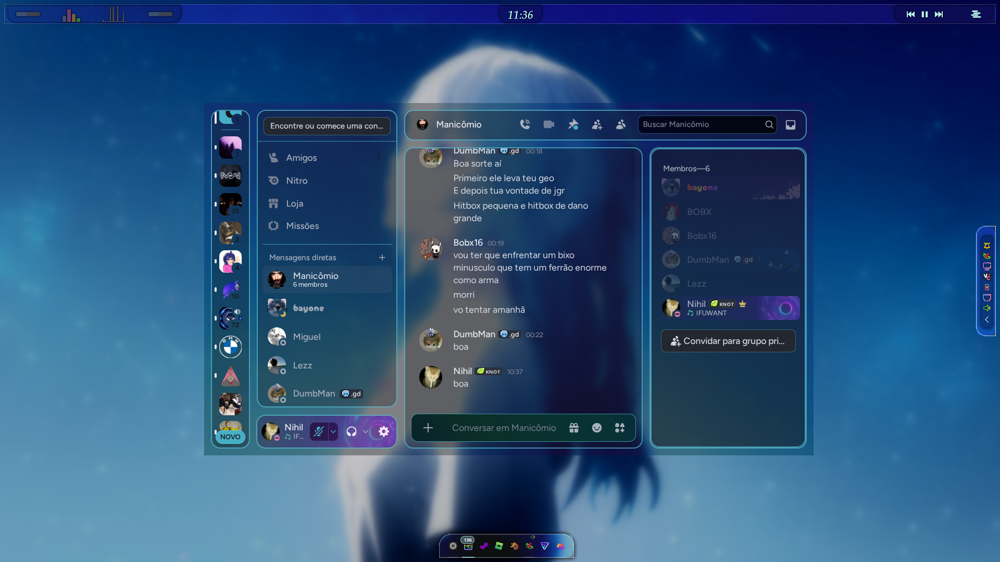

# midnight-glassy-bluer

A dark, glassy Discord theme with translucent panels, light blue borders and brighter text.

> Based on **[midnight](https://github.com/refact0r/midnight-discord)** by **[refact0r](https://github.com/refact0r)**.

## Installation

### 1. Get a client mod

The theme needs a Discord client that supports custom themes. Pick one:

| Client | What it is | Download |
|---|---|---|
| **Vesktop** | Standalone Discord app with Vencord built in (recommended on Linux) | [vesktop.dev](https://vesktop.dev) · [GitHub releases](https://github.com/Vencord/Vesktop/releases) |
| **Vencord** | Mod installed on top of the official Discord app | [vencord.dev/download](https://vencord.dev/download) |
| **BetterDiscord** | Mod installed on top of the official Discord app | [betterdiscord.app](https://betterdiscord.app) |

### 2. Download the theme

Download [`midnight-glassy-bluer.theme.css`](https://raw.githubusercontent.com/Nihil-6/midnight-glassy-bluer/main/midnight-glassy-bluer.theme.css) (right-click → *Save link as...*), or open the file on GitHub and click the **Download raw file** button.

### 3. Install it

**Vesktop / Vencord**

1. Open Discord settings → **Vencord** → **Themes**.
2. Click **Open Themes Folder** and move the `.css` file into it.
3. Enable **midnight-glassy-bluer** in the list.

> Alternatively, go to the **Online Themes** tab and paste this link, so the theme updates automatically:
> `https://raw.githubusercontent.com/Nihil-6/midnight-glassy-bluer/main/midnight-glassy-bluer.theme.css`

**BetterDiscord**

1. Open Discord settings → **BetterDiscord** → **Themes**.
2. Click **Open Themes Folder** and move the `.css` file into it.
3. Toggle **midnight-glassy-bluer** on.

### 4. Enable the glass effect

The panels are translucent, but the Discord window itself must be transparent to see your wallpaper:

- **Vesktop / Vencord:** in **Vencord** settings, turn on **Enable window transparency** and restart Discord.
- **Linux:** a compositor blur (e.g. Better Blur on KDE/KWin) blurs the wallpaper behind the window.

## Customization

Tweak the variables at the top of the file:

| Variable | Description |
|---|---|
| `--glass-veil` | Background veil opacity (default 55%) |
| `--glass-panel` | Extra panel opacity (default 30%) |
| `--border-blue` | Border color |
| `--border-thickness` | Border width (default 2px) |

## License

[MIT](LICENSE)
